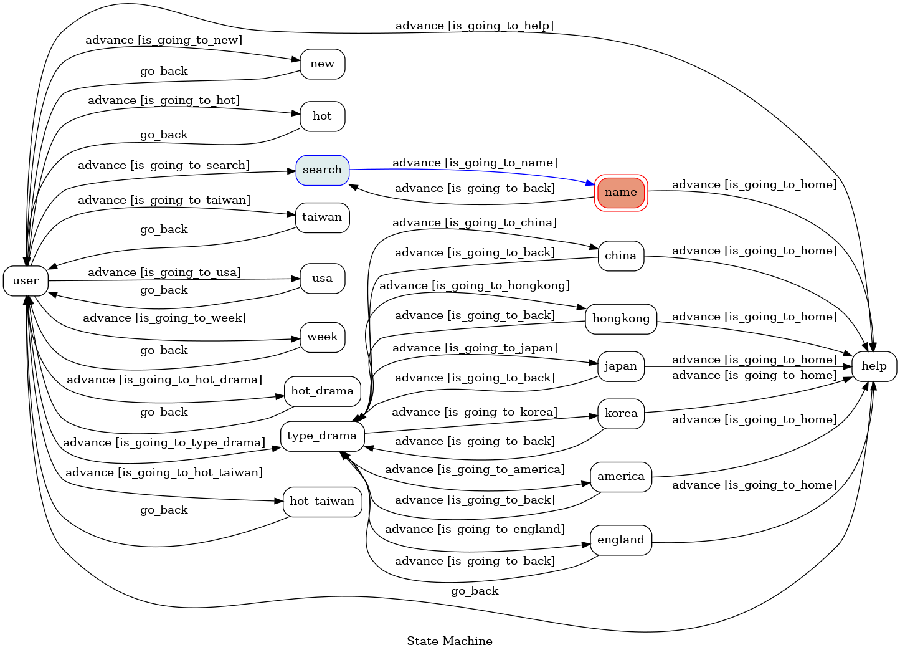

# Streaming-Linebot

<div align="center">


<p align=center>
    <a target="_blank" href="#" title="language count"></a>
    <a target="_blank" href="#" title="top language"></a>
    <a target="_blank" href="#" title="repo size"></a>
    <a target="_blank" href="http://makeapullrequest.com" title="PRs Welcome"></a>
</p>

</div>

- A Line bot that provides dramas, movies, animation based on a finite state machine(FSM). Webscrapping dramas from [douban](https://www.douban.com/), animation from [動畫瘋](https://ani.gamer.com.tw/), movies from [yahoo movies](https://movies.yahoo.com.tw/).  

## Finite State Machine
- The initial state is `user`
- Users can change the state by text button




## Features
- There are 3 main features : dramas, movies, animation.
- This bot will provide top-10 the most popular and the newest dramas, movies, animation.
- Users can also search by the name or the types through line text button.


### Home

       

### Dramas
#### Popular dramas 
#### Popular comedies
 

#### Popular dramas from different countries
  <br> 
  

### Movies
#### Hot taiwan movies
#### Hot American movies
#### New Moives this week
       

### Animation
#### Hot animation
#### New animation
#### Search animation
  

## Setup
* Python 3.8

### Install Dependency
```
$ pip install -r requirements.txt
```

* pygraphviz (For visualizing Finite State Machine)
    * [Setup pygraphviz on Ubuntu](http://www.jianshu.com/p/a3da7ecc5303)
	* [Note: macOS Install error](https://github.com/pygraphviz/pygraphviz/issues/100)


#### Secret Data
Set `Channel_Access_Token`, `Channel_Secret`, `User_id`
`LINE_CHANNEL_SECRET` and `LINE_CHANNEL_ACCESS_TOKEN` **MUST** be set to proper values.
Otherwise, you might not be able to run your code.


## Reference
[Pipenv](https://medium.com/@chihsuan/pipenv-更簡單-更快速的-python-套件管理工具-135a47e504f4) ❤️ [@chihsuan](https://github.com/chihsuan)

[TOC-Project-2019](https://github.com/winonecheng/TOC-Project-2019) ❤️ [@winonecheng](https://github.com/winonecheng)

Flask Architecture ❤️ [@Sirius207](https://github.com/Sirius207)

[Line line-bot-sdk-python](https://github.com/line/line-bot-sdk-python/tree/master/examples/flask-echo)

[Slides](https://hackmd.io/@TTW/ToC-2019-Project#) and [FAQ](https://hackmd.io/s/B1Xw7E8kN)

[[Python+LINE Bot教學]提升使用者體驗的按鈕樣板訊息(Buttons template message)實用技巧](https://www.learncodewithmike.com/2020/07/line-bot-buttons-template-message.html)
